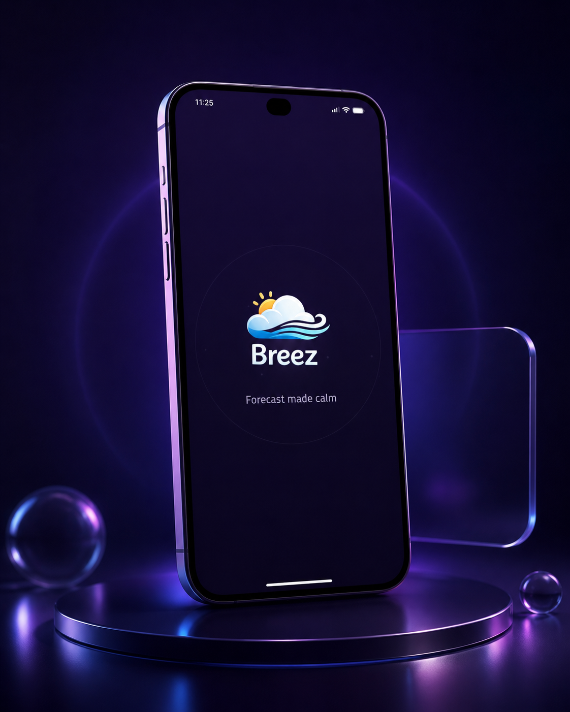
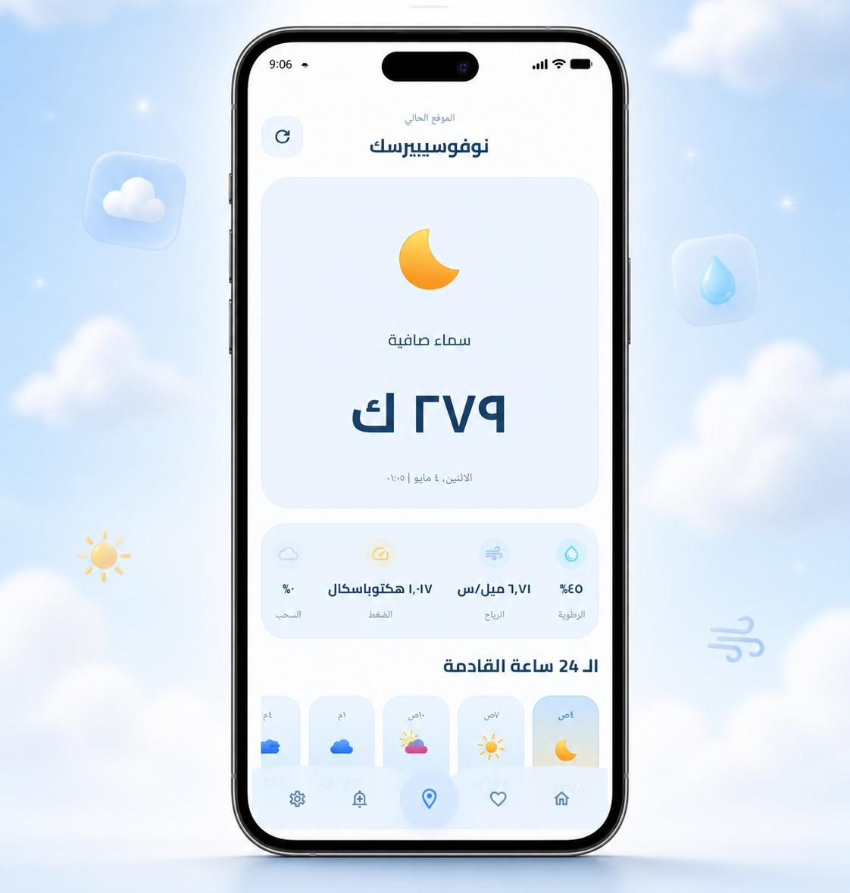
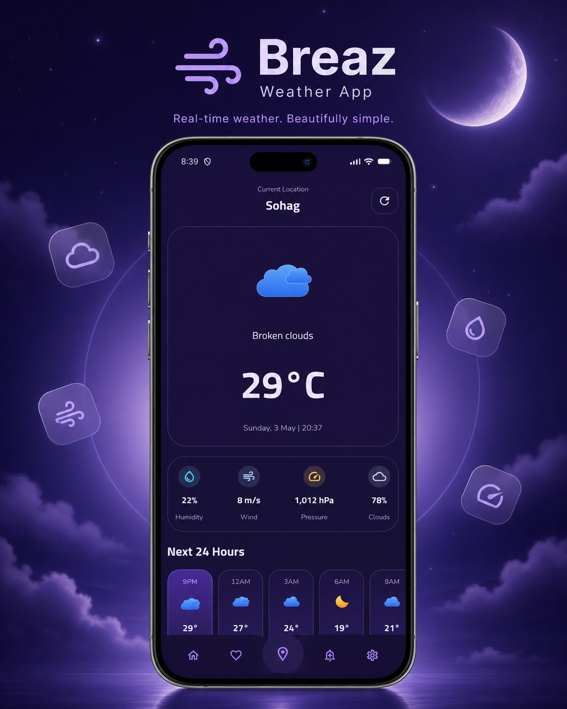
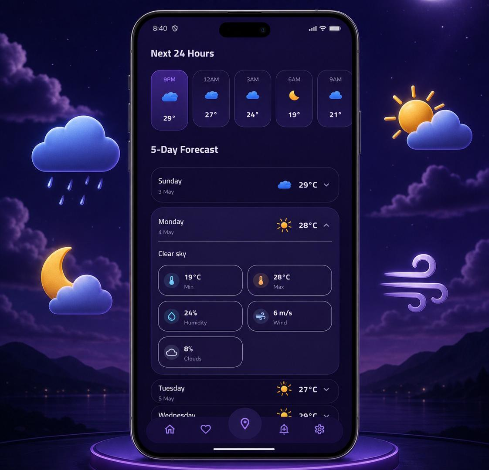
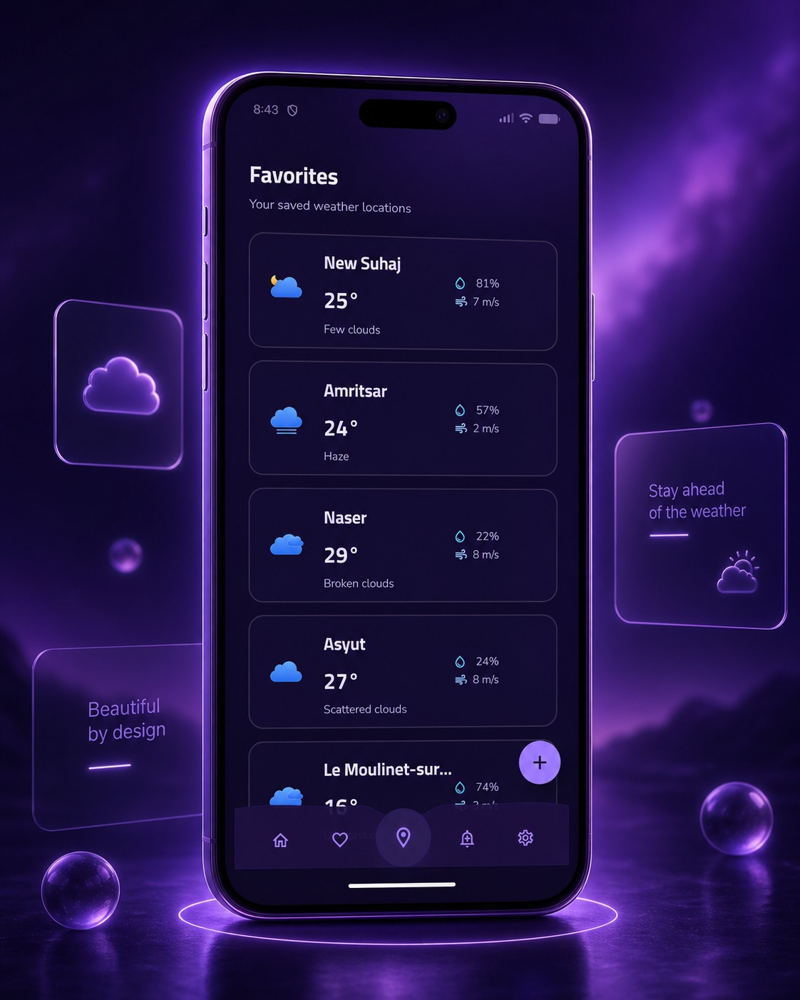
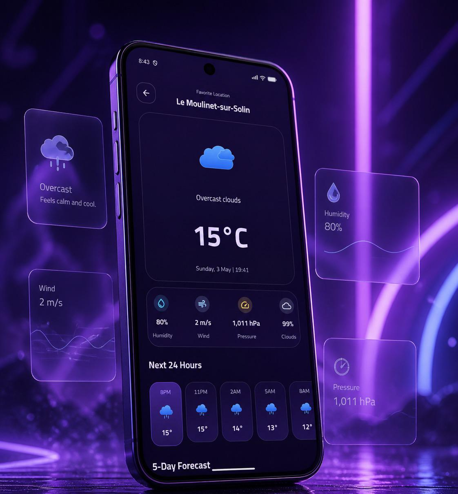
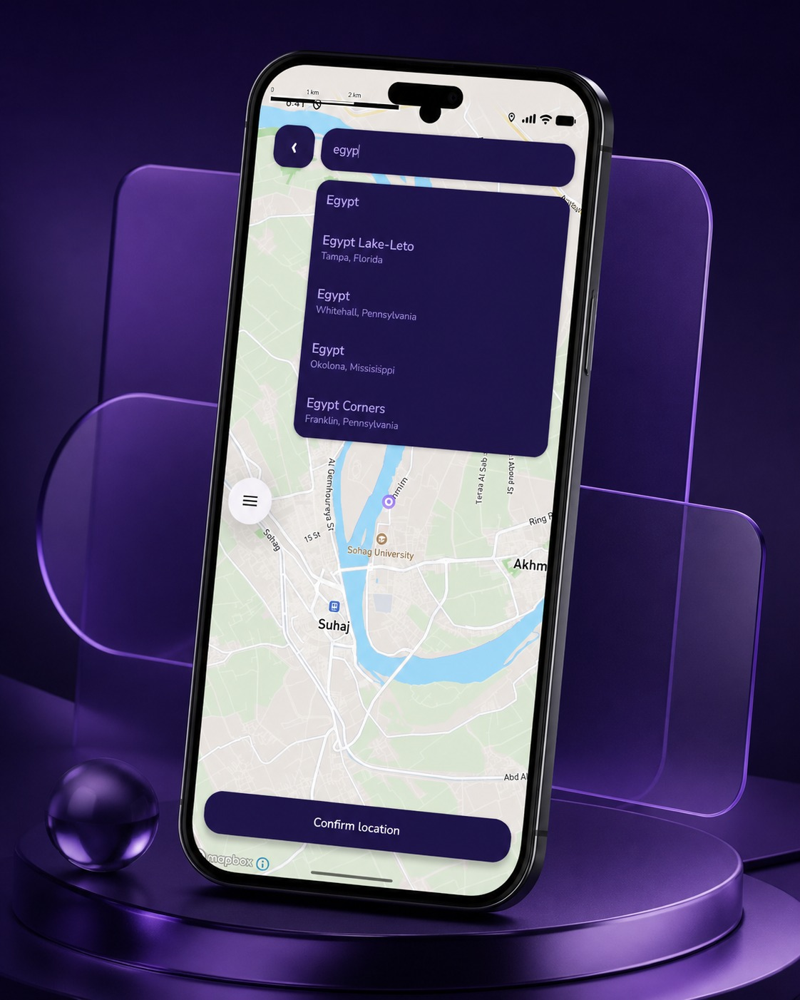
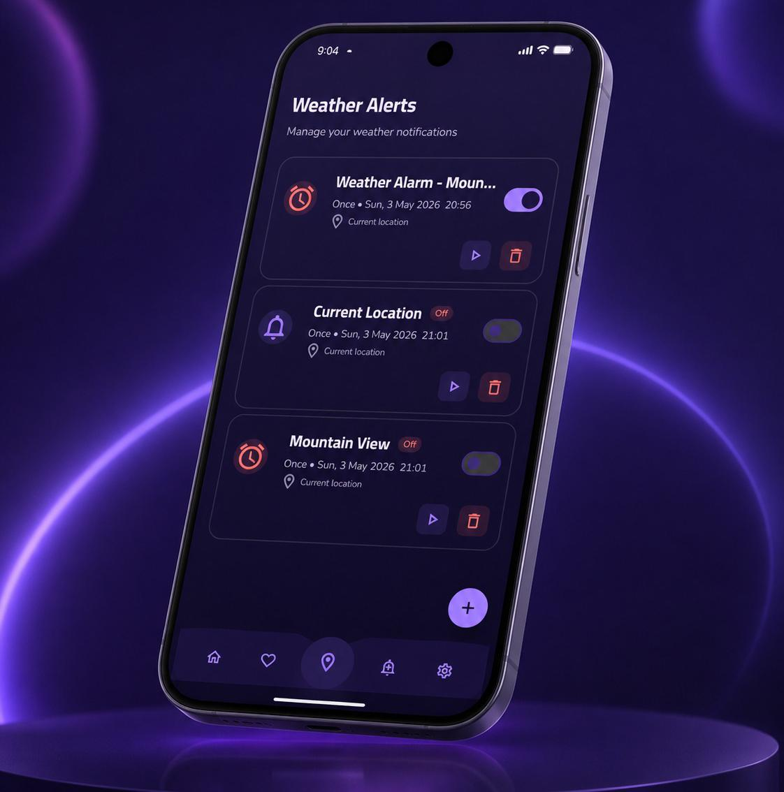

# 🌦️ Breaz — Weather Forecast App


**Breaz** is a modern Android weather forecast application built with **Kotlin**, **Jetpack Compose**, and **Material 3**.

The app provides real-time weather updates, hourly and 5-day forecasts, favorite locations, map-based location picking, weather alerts, localization, and a polished animated UI designed for a smooth daily weather experience.

---

## 📚 Table of Contents

- [Features](#-features)
- [Screenshots](#-screenshots)
- [Architecture](#-architecture)
- [Tech Stack](#-tech-stack)
- [Project Structure](#-project-structure)
- [Data Flow](#-data-flow)
- [App Flow](#-app-flow)
- [Setup](#-setup)
- [API Keys](#-api-keys)
- [API](#-api)
- [Challenges](#-challenges)
- [Solutions](#-solutions)
- [Future Improvements](#-future-improvements)
- [Release](#-release)
- [License](#-license)


---

## ✨ Features

### 🏠 Home Screen

- Display current weather based on user location
- Show temperature, weather condition, humidity, wind speed, pressure, and cloud coverage
- Hourly forecast for the current day
- 5-day forecast overview
- Dynamic weather illustrations using Lottie animations
- Clean responsive UI with Light and Dark mode support

### ⭐ Favorites

- Add favorite locations
- View full weather details for saved locations
- Search and save locations manually
- Swipe-to-delete with undo snackbar
- Local persistence using Room database

### 📍 Location

- Detect current location using GPS
- Pick a location manually from Mapbox map
- Search places using Mapbox Search SDK
- Save selected latitude and longitude
- Use either current location or selected location

### 🔔 Weather Alerts

- Create weather alerts for selected date and time
- Choose alert type: Push Notification or Alarm
- Enable and disable alerts
- Schedule alerts using AlarmManager
- Store alerts locally using Room
- Alerts can be restored after device reboot

### ⚙️ Settings

- Change temperature unit: Celsius, Fahrenheit, Kelvin
- Change wind speed unit: meter/sec or mph
- Switch language: Arabic / English
- Toggle Light / Dark theme
- Manage location source

### 🎨 UI / UX

- Jetpack Compose UI
- Material 3 components
- Custom app theme
- Smooth Lottie weather animations
- Gradient-based visual identity
- Custom cards and clean spacing
- Loading, empty, success, and error states
- Snackbar feedback for user actions

---

## 📱 Screenshots


| Splash | Home Light | Home Dark |
|--------|------------|-----------|
|  |  |  |

| Forecast | Favorites | Favorite Details |
|----------|-----------|------------------|
|  |  |  |

| Map Picker | Alerts | Settings |
|------------|--------|----------|
|  |  |  |
---

## 🏗 Architecture

Breaz follows **MVVM with Clean Architecture principles**, separating UI, domain logic, and data handling.

```text
┌──────────────────────────────────────────────┐
│                     UI                       │
│  Compose Screens → ViewModels → UiState      │
├──────────────────────────────────────────────┤
│                   Domain                     │
│  Models · Repository Contracts · Use Cases   │
├──────────────────────────────────────────────┤
│                    Data                      │
│  Retrofit · Room · DataStore · Mapbox · APIs │
└──────────────────────────────────────────────┘
```

### Architecture Highlights

- **ViewModel** manages UI state and user actions
- **Repository** abstracts local and remote data sources
- **Room** stores favorites and alerts
- **DataStore** stores app settings
- **Retrofit** handles OpenWeatherMap API requests
- **Hilt** provides dependency injection
- **Kotlin Flow** keeps data reactive and lifecycle-aware
- **UiState** pattern keeps screens predictable and easier to debug

---

## 🛠 Tech Stack

| Category | Technology |
|---------|------------|
| Language | Kotlin |
| UI | Jetpack Compose |
| Design | Material 3 |
| Architecture | MVVM + Clean Architecture |
| Dependency Injection | Hilt |
| Networking | Retrofit + OkHttp |
| Async | Kotlin Coroutines + Flow |
| Local Database | Room |
| Preferences | DataStore |
| Maps | Mapbox Maps SDK |
| Search | Mapbox Search SDK |
| Location | Google Play Services Location |
| Alerts | AlarmManager + BroadcastReceiver |
| Animations | Lottie |
| Images | Coil |
| Build System | Gradle Kotlin DSL |

---

## 📂 Project Structure

```text
com.example.breez
│
├── data
│   ├── db
│   │   ├── dao
│   │   ├── entity
│   │   └── BreezDatabase
│   │
│   ├── dto
│   │   ├── current
│   │   └── forecast
│   │
│   ├── location
│   │   └── LocationProvider
│   │
│   ├── network
│   │   ├── WeatherApiService
│   │   ├── NetworkModule
│   │   └── ApiResult
│   │
│   ├── notification
│   │   ├── AlertScheduler
│   │   ├── NotificationHelper
│   │   └── AlertReceiver
│   │
│   ├── repository
│   │   └── BreezRepositoryImpl
│   │
│   └── settings
│       └── SettingsDataStore
│
├── domain
│   ├── model
│   └── repository
│
├── presentation
│   ├── alerts
│   ├── components
│   ├── favorites
│   ├── home
│   ├── location
│   ├── navigation
│   ├── settings
│   ├── splash
│   └── theme
│
├── di
│   └── AppModule
│
└── MainActivity
```

---

## 📊 Data Flow

```text
User Action
   ↓
Compose Screen
   ↓
ViewModel
   ↓
Repository
   ↓
Remote API / Local Database / DataStore
   ↓
UiState
   ↓
Screen Recomposition
```

Example:

```text
User selects location
   ↓
MapboxPickLocationScreen
   ↓
Repository
   ↓
OpenWeatherMap API
   ↓
Weather UiState
   ↓
Home Screen updates
```

---

## 🔄 App Flow

```text
Splash Screen
   ↓
Home Screen
   ↓
Bottom Navigation
   ├── Home
   ├── Favorites
   ├── Add Alert
   └── Settings
```

---

## ⚙️ Setup

### Prerequisites

- Android Studio Hedgehog or newer
- JDK 17
- Kotlin
- Min SDK 24+
- OpenWeatherMap API key
- Mapbox account and access token

---

### 1. Clone the repository

```bash
git clone https://github.com/yourusername/Breaz-Weather-App.git
cd Breaz-Weather-App
```

---

### 2. Open in Android Studio

Open Android Studio, then choose:

```text
File → Open → Breaz-Weather-App
```

Wait until Gradle sync finishes.

---

## 🔑 API Keys

Create or open `local.properties` in the root project folder.

Add:

```properties
OPENWEATHER_API_KEY=your_openweather_api_key
MAPBOX_PUBLIC_TOKEN=your_mapbox_public_token
MAPBOX_SECRET_TOKEN=your_mapbox_secret_token
```

> Do not push `local.properties` to GitHub.

---

### Mapbox Maven Setup

Inside `settings.gradle.kts`, add the Mapbox Maven repository:

```kotlin
dependencyResolutionManagement {
    repositoriesMode.set(RepositoriesMode.FAIL_ON_PROJECT_REPOS)
    repositories {
        google()
        mavenCentral()

        maven {
            url = uri("https://api.mapbox.com/downloads/v2/releases/maven")
            credentials {
                username = "mapbox"
                password = providers.gradleProperty("MAPBOX_SECRET_TOKEN").get()
            }
            authentication {
                create<BasicAuthentication>("basic")
            }
        }
    }
}
```

---

## 🌐 API

Breaz uses the **OpenWeatherMap API**.

| Endpoint | Usage |
|---------|-------|
| `/data/2.5/weather` | Current weather |
| `/data/2.5/forecast` | 5-day / 3-hour forecast |

---


## 🚀 Release

You can download the latest APK release from here:

[](https://github.com/Aalaa-Adel/weather-app/releases/latest)

### Latest Release: `v1.0.0`

Initial stable release of **Breaz Weather App**.

Includes:

- Current weather
- Hourly forecast
- 5-day forecast
- Favorite locations
- Mapbox location picker
- Weather alerts
- Settings
- Arabic / English support
- Light / Dark theme

---

## 📄 License

This project is licensed under the **MIT License**.

[](https://github.com/Aalaa-Adel/weather-app/blob/main/LICENSE)

You can read the full license here:

👉 [MIT License](https://github.com/Aalaa-Adel/weather-app/blob/main/LICENSE)


---

